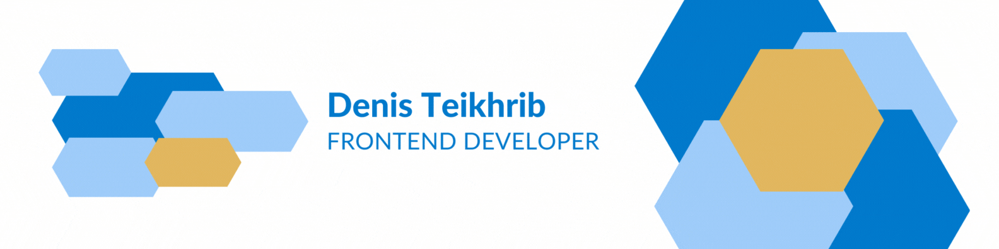

# Hi there 

Frontend Developer with experience building scalable and high-load websites.
 
Tech stack includes React, TypeScript, JavaScript (ES6+), PostCSS, and JSX as a templating engine.
 
Strong focus on component architecture, code maintainability, and scalability.
 
Experienced in creating reusable components, working with REST APIs, asynchronous operations, and maintaining clean,
type-safe code following modern development practices.
 

## :mailbox_with_mail: My contacts

## :hammer_and_wrench: Technologies & tools that I use

### :atom: Languages, Frameworks, and Libraries

### :wrench: Software, Tools

## :chart_with_upwards_trend: GitHub Stats

  <picture>
    <source 
      srcset="https://github-readme-stats.vercel.app/api?username=Teihden&show_icons=true&count_private=trueborder_color&theme=github_dark&border_color=21262d&card_width=400px"
      media="(prefers-color-scheme: dark)"
    />
    <source
      srcset="https://github-readme-stats.vercel.app/api?username=Teihden&show_icons=true&count_private=true&icon_color=007acc&text_color=24292f&title_color=007acc&theme=default&card_width=400px"
      media="(prefers-color-scheme: light), (prefers-color-scheme: no-preference)"
    />
    
  </picture>
  &nbsp;
  <picture>
    <source 
      srcset="https://streak-stats.demolab.com/?user=Teihden&theme=github-dark-blue&border=21262d&stroke=21262d&sideLabels=c9d1d9&currStreakLabel=c9d1d9"
      media="(prefers-color-scheme: dark)"
    />
    <source
      srcset="https://streak-stats.demolab.com/?user=Teihden&ring=007acc&fire=1da1f2&currStreakNum=24292f&currStreakLabel=24292f&sideNums=24292f&SideLabels=1da1f2"
      media="(prefers-color-scheme: light), (prefers-color-scheme: no-preference)"
    />
    
  </picture>

 

<picture>
  <source 
    srcset="https://github-readme-stats.vercel.app/api/top-langs?username=Teihden&show_icons=true&count_private=true&layout=compact&langs_count=10&theme=github_dark&border_color=21262d"
    media="(prefers-color-scheme: dark)"
  />
  <source
    srcset="https://github-readme-stats.vercel.app/api/top-langs?username=Teihden&show_icons=true&count_private=true&layout=compact&langs_count=10&text_color=24292f&title_color=007acc&theme=default"
    media="(prefers-color-scheme: light), (prefers-color-scheme: no-preference)"
  />
  
</picture>
